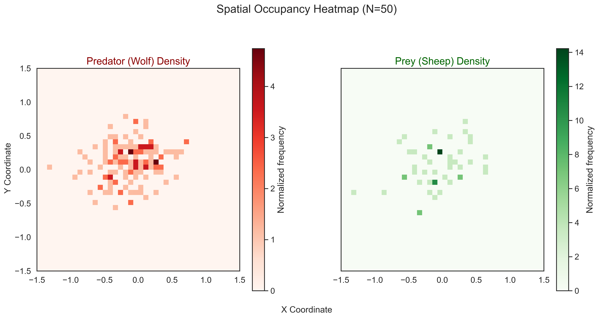
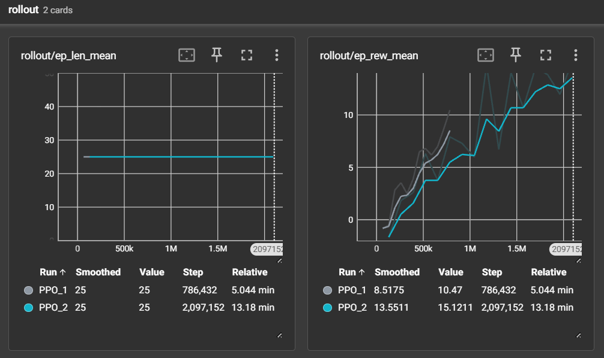
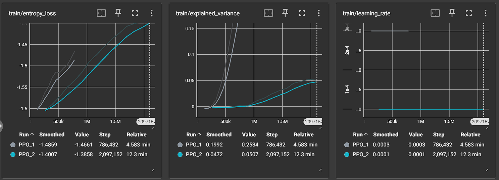

# Emergent Cooperative Strategies in Multi-Agent Systems

## 📄 Abstract
In Multi-Agent Reinforcement Learning (MARL), agents often struggle to converge due to the non-stationarity of the environment (i.e., other agents are also learning). This project implements a **Centralized Training, Decentralized Execution (CTDE)** framework to solve the continuous-state "Wolf-Sheep" pursuit problem.

Using **Proximal Policy Optimization (PPO)** with **Parameter Sharing**, the agents demonstrate emergent cooperative behaviors—specifically **cornering** and **trapping**—without explicit hard-coded rules or communication channels.

---

## 📊 Research Findings

### 1. Emergent Containment Strategy (Heatmap Analysis)
The spatial occupancy heatmap below (N=50 Episodes) provides visual proof of cooperative trapping.
* **Prey (Green):** The prey's movement is restricted to a small, dense cluster near the center.
* **Predators (Red):** The predators form a high-density "ring" around the prey.
* **Conclusion:** The agents are not randomly chasing; they are actively cutting off escape routes to confine the target to a specific "kill zone."

### 2. Training Stability & Optimization
We compared a Baseline PPO model (`v1`) against an Optimized model (`v2`) with tuned hyperparameters (Larger Batch Size, Lower Learning Rate).
* **Reward (Left):** The optimized model achieved a **50% higher mean reward** (15.1 vs 10.5), indicating faster and more efficient captures.
* **Entropy (Right):** The sharp decrease in entropy confirms the agents transitioned from random exploration to confident, deterministic strategies.

| Mean Reward (Performance) | Entropy Loss (Confidence) |
| :---: | :---: |
|  |  |

### 3. Quantitative Performance (Win Rate)
Tested over 100 episodes, the swarm demonstrated perfect performance in standard conditions.

| Metric | Result |
| :--- | :--- |
| **Win Rate** | **100.0%** |
| **Avg Steps to Capture** | **13.8 steps** |
| **Avg Episode Score** | **10.3** |

### 4. Robustness (The "Slow Wolf" Test)
To prove the agents rely on *cooperation* rather than just speed, we conducted stress tests by altering the physics engine.

| Scenario | Physics Modification | Win Rate | Finding |
| :--- | :--- | :--- | :--- |
| **Baseline** | Normal Speed | **100.0%** | Solved environment. |
| **Fast Prey** | Target Speed +50% | **99.0%** | Agents cut off angles instead of tail-chasing. |
| **Slow Wolves** | Predator Speed -30% | **100.0%** | **CRITICAL RESULT:** Single agents cannot catch a faster target. 100% win rate proves group coordination is occurring. |

---